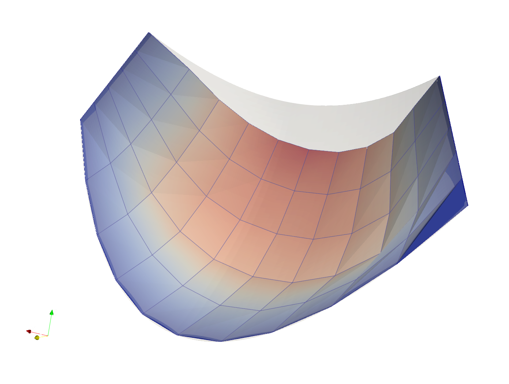
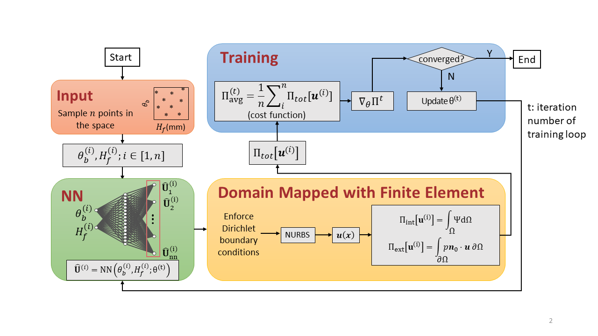

## Research Experience and Interests

My research experience began in the Oden Insitute during my third year of undergrad in the Willerson Center for Cardiovascular Modeling and Simulation (WCCMS). I worked modeling the deformation of Valve Interstitial Cells (VICs) due to the contactile nature of stress fibers present in the cells. I then worked on implementing an approach to analytically compute the eigenvalues and eigenvectors of Diffusion Tensor Imaging (DTI) data in FEniCS to use a DTI-informed material model.

In graduate school, I have continued to work in WCCMS. I have transitioned to work on Machine Learning, where we use a Neural Network as a surrogate model of the Finite Element method (using a method coined the "NNFE" approach) to minimize the potential energy of the hyperelastic BVPs that govern heart valve leaflet deformation. 

My research interests can be broadly described as computational medicine and machine learning, with a focus on surrogate modeling and dimensionality-reduction approaches to approximating the solution of PDEs. My favorite course I have taken at Oden is either Machine Learning and Data Science or Functional Analysis (shoutout Leszek Demkowicz), and my favorite course as an undergraduate was Advanced Scientific Computing, which was basically an advanced linear algebra course that introduced the Finite Element Method - the final project was solving a 1D heat equation using the Galerkin Method.

Below are some figures from my research.

| |  |